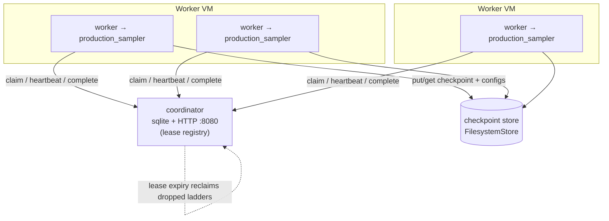

# NH lattice-glass PT campaign — distributed deployment

Run a parallel-tempering (PT) sampling campaign for the NH lattice glass across
many reclaimable, heterogeneous OpenStack VMs. This directory is the campaign
control plane: a lease **coordinator**, a checkpoint **store**, a **worker**
agent, and the two deploy scripts (`bootstrap.sh`, `launch.sh`).

## 1. Architecture

One **ladder** = one PT run = one work unit (a single temperature ladder, fixed
`L` and `seed`, sampled to a `target_configs` quota at the cold replica).

- The **coordinator** (`dist.coordinator`) is a tiny sqlite + HTTP service: a
  lease registry that hands ladders to workers and tracks per-ladder progress.
  It is the single source of truth.
- A **worker** (`dist.worker`) claims a ladder, pulls its checkpoint from the
  store (if any), drives `experiments/production_sampler` for a bounded lease
  window, heartbeats progress, then pushes the fresh checkpoint + per-temperature
  config `.npy` files back to the store and reports the ladder done (quota met)
  or releases it for continuation.
- The **store** (`dist.store.FilesystemStore`) is the durable home for each
  ladder's checkpoint and configs.

Robustness comes from **lease expiry**: if a worker is preempted or dies
mid-run, its lease lapses and the ladder is reclaimed by the next claimant,
which resumes from the last checkpoint. Workers are stateless cattle; all durable
state lives in the coordinator db + the checkpoint store.

```
        claim / heartbeat / complete (HTTP, JSON)
   workers ───────────────────────────────────────►  coordinator
   (cattle)                                           sqlite + HTTP :8080
      │                                               (lease registry)
      │  put/get checkpoint + configs                       │
      ▼                                                     │ lease expiry
   checkpoint store  ◄───── durable / backed storage ──────┘ reclaims dropped
   (FilesystemStore)                                          ladders
```



## 2. Define a campaign

A campaign is a JSON file listing the ladders to sample:

```json
{
  "ladders": [
    {
      "ladder_id": "L20_b1.0-3.0_s0001",
      "L": 20,
      "n_temps": 16,
      "beta_min": 1.0,
      "beta_max": 3.0,
      "seed": 1,
      "warmup": 200000,
      "sample_every": 50,
      "exchange_every": 10,
      "target_configs": 1000
    }
  ]
}
```

Generate a grid over seeds at a fixed `L` / beta-grid (here `beta_max=3.0`, i.e.
cold replica `T = 1/beta ≈ 0.333` — the accessible NH floor; see the caveat):

```bash
python3 -c 'import json; json.dump({"ladders":[{"ladder_id":f"L20_b1.0-3.0_s{s:04d}","L":20,"n_temps":16,"beta_min":1.0,"beta_max":3.0,"seed":s,"warmup":200000,"sample_every":50,"exchange_every":10,"target_configs":1000} for s in range(1,201)]}, open("campaign.json","w"), indent=2)'
```

`ladder_id` **must be unique and stable**. The coordinator upserts keyed on
`ladder_id`, so re-running the coordinator with the same JSON is idempotent and
**preserves progress** — never reuse an id for different physics, and never
renumber existing ladders, or you will silently fork or clobber their state.

## 3. Run the coordinator

Put the coordinator on one small, always-on VM:

```bash
python3 -m dist.coordinator \
    --db campaign.db \
    --host 0.0.0.0 \
    --port 8080 \
    --campaign campaign.json \
    --lease-default-secs 3600
```

Both `--db campaign.db` and the checkpoint store **must live on durable, backed
storage** (a persistent Cinder volume, not the instance's ephemeral disk): they
are the only state that survives a worker — or the coordinator VM — being
recycled. Re-running this command after a campaign edit upserts new ladders and
keeps existing progress.

## 4. Bring up workers

On each worker VM, once (or as a golden-image build step):

```bash
./dist/bootstrap.sh        # compiles production_sampler on THIS host (-march=native)
```

Then start and supervise N workers pointed at the coordinator:

```bash
COORDINATOR_URL=http://<coord>:8080 \
STORE_ROOT=/mnt/shared/store \
N_WORKERS=8 \
./dist/launch.sh
```

`launch.sh` runs each worker in a respawn loop and forwards SIGINT/SIGTERM so a
preempted worker checkpoints and the rest restart automatically. Per-worker logs
land in `$WORKDIR/w<i>.log` (default `WORKDIR=/tmp/nhlg_work`).

To rejoin reclaimed VMs automatically, run `launch.sh` from a restart-on-failure
service. Sample systemd unit (`/etc/systemd/system/nhlg-worker.service`):

```ini
[Unit]
Description=NH lattice-glass PT workers
After=network-online.target
Wants=network-online.target

[Service]
Type=simple
User=nhlg
WorkingDirectory=/opt/lattice-glass
# bootstrap.sh is normally baked into the golden image; uncomment to (re)build on boot:
# ExecStartPre=/opt/lattice-glass/dist/bootstrap.sh
ExecStart=/opt/lattice-glass/dist/launch.sh
Environment=COORDINATOR_URL=http://coord.internal:8080
Environment=STORE_ROOT=/mnt/shared/store
Environment=N_WORKERS=8
Environment=LEASE_SECS=3600
Restart=always
RestartSec=10
# Forward SIGTERM to the worker group and give it time to checkpoint on stop.
KillMode=mixed
TimeoutStopSec=120

[Install]
WantedBy=multi-user.target
```

```bash
sudo systemctl enable --now nhlg-worker.service
```

### Manual / single-shot worker (debugging)

`launch.sh` is just a supervisor around the frozen worker CLI; run one directly
to debug, optionally with `--once` to lease, run a single ladder, and exit:

```bash
python3 -m dist.worker \
    --coordinator http://<coord>:8080 \
    --store-root /mnt/shared/store \
    --binary experiments/production_sampler \
    --workdir /tmp/w0 \
    --lease-secs 3600 --poll-secs 30 --margin-secs 60 --once
```

## 5. OpenStack specifics

- **Use pinned-CPU flavors** (`hw:cpu_policy=dedicated`, typically with
  `hw:cpu_thread_policy=prefer/isolate`) so each worker gets a real physical
  core. The sampler is CPU-bound and cache-sensitive; on a contended /
  overcommitted vCPU throughput degrades **2–5×** and, worse, the per-sweep cost
  model the campaign uses to size lease windows becomes invalid. Size
  `N_WORKERS` to the dedicated cores the flavor actually pins.
- **Find idle capacity from REAL host utilization**, not Placement. Placement's
  allocatable vCPU reflects the configured overcommit ratio (often 16:1), i.e.
  how many vCPUs *may* be scheduled — not how many physical cores are idle.
  Measure actual host CPU usage via Gnocchi/Ceilometer (or host-level telemetry)
  and target genuinely underutilized hypervisors.
- **Use transient / preemptible capacity freely.** Lease expiry already handles
  instances being reclaimed mid-run, so spot/preemptible or
  drain-when-needed pools are a good fit — a reclaimed VM's ladders are simply
  re-leased and resumed from checkpoint elsewhere.

## 6. Checkpoint store

Today the store is `FilesystemStore` over either a **shared mount** (NFS, or
OpenStack Manila) reachable from every worker, or a **per-host directory synced
to durable storage**. Point every worker at the same `STORE_ROOT`.

The `Store` ABC in `dist/store.py` is the seam for object backends: implement
`put_checkpoint` / `get_checkpoint` / `put_config` / `list_configs` /
`get_config` against S3 or Swift later without touching workers or coordinator.

Sizing: checkpoints are **~80 MB at L=20**, written per ladder per checkpoint;
budget store capacity and shared-mount bandwidth for `N_WORKERS ×` that across
the fleet, plus the per-temperature config `.npy` files each ladder accumulates.

## 7. Honest caveat

- **This infra reaches the *accessible* NH floor (`T/A ≈ 0.30–0.333`); it does
  not break the RFOT wall below that.** Distributing the work buys throughput and
  preemption-tolerance, not lower temperatures. Below the floor the cold replica
  does not equilibrate in feasible wall time regardless of how many VMs you throw
  at it.
- **Restart-safety is not equilibrium.** Checkpoint/resume guarantees a ladder
  continues bit-faithfully across worker deaths; it says nothing about whether
  the cold replica has thermalized. Before trusting any ladder's configs, verify
  equilibration directly — an energy-vs-sweep plateau on the cold replica. The
  sampler logs `E_cold/site` at every checkpoint (the `[seed=S] ...` line); a
  ladder reporting `DONE` only means its config quota was met, not that those
  configs are equilibrium samples.
